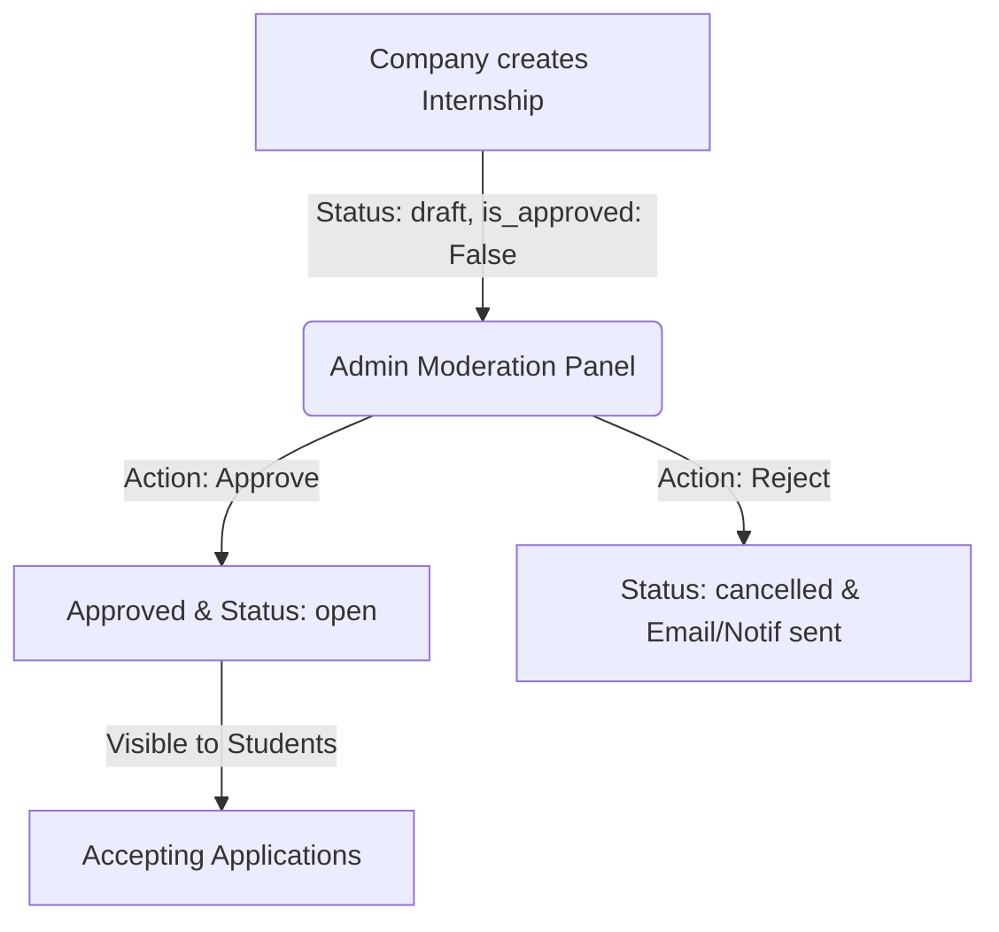

# InternAI - Project Structure, Database Models & Business Logic

InternAI is an AI-powered Internship Management Platform designed to streamline the recruitment, scheduling, evaluation, and monitoring process for student internships. It serves four distinct user roles: **Students**, **Companies (HR)**, **Supervisors**, and **Administrators**.

This document provides a detailed breakdown of the project architecture, file directory structure, data models, and core business workflows.

---

## 1. Project Architecture & Directory Structure

InternAI is built using **Django** (Python) on the backend, **Bootstrap 5** and **Vanilla CSS/JS** on the frontend, and **MySQL** (via XAMPP) for database management. It is organized into modular Django apps.

```
E:\InternAi\
├── internai/                # Project Configuration
│   ├── settings.py          # Database, installed apps, auth, and billing config
│   ├── urls.py              # Root URL router
│   └── wsgi.py              # WSGI entrypoint for production hosting
├── accounts/                # User Auth & Profiles
│   ├── models.py            # CustomUser, StudentProfile, CompanyProfile, SupervisorProfile
│   ├── views.py             # Role-based registration, logins, and passwords
│   └── urls.py              # /accounts/ routing
├── internships/             # Internship Listings
│   ├── models.py            # Internship, InternshipCategory
│   ├── views.py             # Public browsing, searching, and detail views
│   └── urls.py              # /internships/ routing
├── applications/            # Recruitment Pipeline & Submission
│   ├── models.py            # Application model (status tracking, cover letter, resume)
│   ├── views.py             # Application submission & view redirects
│   └── urls.py              # /applications/ routing
├── interviews/              # Interview Scheduling
│   ├── models.py            # Interview model (types, modes, links, outcomes)
│   └── urls.py              # /interviews/ routing
├── reports/                 # Monitoring & Weekly Activity
│   ├── models.py            # WeeklyReport, Evaluation
│   └── urls.py              # /reports/ routing
├── notifications/           # In-App Messaging
│   ├── models.py            # Notification model (application updates, reminders)
│   └── urls.py              # /notifications/ routing
├── billing/                 # Stripe Subscriptions
│   ├── views.py             # Stripe Checkout Sessions, success/cancel callbacks
│   └── urls.py              # /billing/ routing
├── common/                  # Shared Utilities & Core AI Engine
│   ├── ai_engine.py         # PyPDF resume text extractor & Groq Cloud AI / Local matcher
│   ├── context_processors.py# Global unread notifications count & user role processor
│   └── urls.py              # / routing (Public landing website pages)
├── documents/               # File Storage & Logs
│   ├── models.py            # Document storage, ActivityLog auditing
│   └── urls.py              # /documents/ routing
├── static/                  # Shared CSS, JS, and Asset files
├── templates/               # Shared HTML layouts & dashboards
└── manage.py                # Django CLI management script
```

---

## 2. Database Models (Schema)

The platform implements 13 custom database models. Below is the relational structure and detailed schema description.

### 2.1 User Management (`accounts` App)
- **[CustomUser](file:///e:/InternAi/accounts/models.py#L30-L159)**: Inherits from Django's `AbstractUser`. Uses `email` as the unique username login credential.
  - `role`: Choices are `student`, `company`, `supervisor`, `admin`.
  - `phone`: Contact phone number.
  - `avatar`: Profile image.
  - `is_email_verified`: Verification flag.
- **[StudentProfile](file:///e:/InternAi/accounts/models.py#L160-L364)**: Linked to `CustomUser` via One-to-One relationship.
  - `university`, `department`, `student_id`, `gpa`: Academic credentials.
  - `education_level`: Degree level choices (Bachelor's, Master's, etc.).
  - `skills`: Comma-separated technical skill list.
  - `portfolio_url`, `github_url`, `linkedin_url`: Portfolio link fields.
- **[CompanyProfile](file:///e:/InternAi/accounts/models.py#L365-L514)**: Linked to `CustomUser` via One-to-One relationship.
  - `company_name`, `logo`, `industry`, `company_size`, `website`, `description`.
  - `is_verified`: Approved by platform admin.
  - `subscription_plan`: Choices are `basic` (free), `pro` ($20/mo), `ultimate` ($80/mo).
- **[SupervisorProfile](file:///e:/InternAi/accounts/models.py#L515-L610)**: Linked to `CustomUser` via One-to-One relationship.
  - `designation`: Professor, Assistant Professor, Lecturer, etc.
  - `expertise`: Comma-separated list of expertise areas.
  - `max_students`: Max students limit capacity (default 10).

### 2.2 Listings & Applications (`internships` & `applications` Apps)
- **[InternshipCategory](file:///e:/InternAi/internships/models.py#L15-L42)**: Categories like "Software Development", "Data Science".
- **[Internship](file:///e:/InternAi/internships/models.py#L44-L198)**: Listing posted by a company.
  - `status`: `draft`, `open` (accepting apps), `closed`, `filled`, `cancelled`.
  - `internship_type`: `onsite`, `remote`, `hybrid`.
  - `is_approved`: Must be set to `True` by an Admin for the post to be visible.
  - `skills_required`: Comma-separated string for filtering.
- **[Application](file:///e:/InternAi/applications/models.py#L15-L126)**: Submission by a student to an internship.
  - `status`: `pending`, `reviewing`, `assessment`, `interview`, `offer`, `accepted`, `rejected`, `withdrawn`.
  - `cover_letter`, `resume` (PDF file upload).
  - `ai_match_score`: AI-calculated compatibility percentage (0-100%).
  - `company_notes`, `rejection_reason`: HR notes.

### 2.3 Interviews & Activity Tracking (`interviews`, `reports`, `notifications` & `documents` Apps)
- **[Interview](file:///e:/InternAi/interviews/models.py#L14-L141)**: An interview scheduled for a candidate's application.
  - `interview_type`: `technical`, `hr`, `behavioral`, `group`, `final`.
  - `mode`: `online` (with `meeting_link`), `onsite` (with physical `location`), `phone`.
  - `outcome`: `pending`, `passed`, `failed`, `no_show`, `rescheduled`.
  - `scheduled_at`, `duration_minutes`, `notes`, `score` (out of 100).
- **[WeeklyReport](file:///e:/InternAi/reports/models.py#L15-L140)**: Ongoing monitoring of student internships.
  - `week_number`, `title`, `activities`, `challenges`, `next_week_plan`, `hours_worked`.
  - `status`: `draft`, `submitted`, `reviewed`, `approved`, `rejected`.
  - `score` (out of 100), `feedback` from assigned academic supervisor.
- **[Evaluation](file:///e:/InternAi/reports/models.py#L141-L248)**: Formal supervisor assessment sheet.
  - `technical_score`, `communication_score`, `professionalism_score`, `attendance_score`, `overall_score` (each rated 1-10).
  - `comments`, `recommendation`, `is_final` evaluation.
- **[Notification](file:///e:/InternAi/notifications/models.py#L15-L129)**: System notifications triggering on workflows.
- **[Document](file:///e:/InternAi/documents/models.py#L14-L118)**: General uploads (Resume, Transcript, Certificates, Offer Letters).
- **[ActivityLog](file:///e:/InternAi/documents/models.py#L119-L167)**: Audit logs of user logins, registrations, profile updates, and applications.

---

## 3. End-to-End Business Logic & Workflows

InternAI orchestrates multiple workflows across roles. Below is the business logic guiding each flow.

### 3.1 Role-Based Registration & Portal Isolation
1. **Signup**: Users choose their portal type (Student, Company, or Supervisor) during registration.
2. **Profile Creation**: Registration forms automatically instantiate the associated profile models (`StudentProfile`, `CompanyProfile`, or `SupervisorProfile`).
3. **Portal Decorator Routing**: The custom `@role_required` decorator restricts access to views:
   - Students cannot access recruiter/admin URLs, and vice versa.
   - Upon logging in, the view `dashboard_redirect` checks `user.get_dashboard_url()` and forwards the user to their respective workspace.

---

### 3.2 Internship Moderation Flow



1. **Recruiter Post**: Recruiters fill the `InternshipForm`. The post is saved with `status='draft'` and `is_approved=False`.
2. **Admin Moderation**: The admin views the listing in `/administration/internship-moderation/` and can click **Approve** or **Reject**:
   - **Approve**: Sets `is_approved=True` and `status='open'`. Triggers a notification to the company.
   - **Reject**: Sets `is_approved=False` and `status='cancelled'`. Triggers a rejection notification.
3. **Discovery**: Approved and open internships are listed in the public search/browse directory.

---

### 3.3 Resume Extraction & AI Match Scoring

When a student applies to an open internship:
1. **Resume Processing**: The student uploads a PDF resume.
2. **Text Extraction**: The system invokes **[`extract_text_from_pdf`](file:///e:/InternAi/common/ai_engine.py#L17-L31)** (powered by `pypdf.PdfReader`) to pull plain text content from the file stream.
3. **Match Scoring**: The core engine **[`calculate_skill_match`](file:///e:/InternAi/common/ai_engine.py#L34-L102)** triggers:
   - **Groq Cloud AI (Llama-3.3-70b-versatile)**: If a `GROQ_API_KEY` is present in configuration, the engine prompts the LLM to inspect the resume text against the internship title, required skills, and description. It enforces a strict JSON schema output including a score (50-98), list of matched/missing skills, and recruiter recommendations.
   - **Local NLP Fallback**: If the key is missing or the Groq service fails, the system executes **[`_local_skill_match`](file:///e:/InternAi/common/ai_engine.py#L105-L152)**. It normalizes words, extracts keyword patterns (regex boundaries) matching the required skills list, and applies title matches for compatibility calculations.
4. **Recruitment Dashboard**: Recruiters view candidates ordered by `ai_match_score` for fast candidate screening.

---

### 3.4 Recruitment Pipeline & Interview Scheduling
1. **Pipeline Stages**: Recruiter reviews the candidate profile and updates the status.
   - `pending` (Default) $\rightarrow$ `reviewing` $\rightarrow$ `assessment` $\rightarrow$ `interview` $\rightarrow$ `offer` $\rightarrow$ `accepted` / `rejected`.
2. **Scheduling**: From the applicant page, HR can click "Schedule Interview" which opens the schedule form:
   - HR defines the type (Technical, HR, final), mode (online/onsite), and date.
   - If `online`, HR inputs a Google Meet/Zoom link.
   - On save, the application status updates to `interview`.
   - An in-app `Notification` is automatically generated for the student.
3. **Offer / Decision**: If the candidate passes all rounds, HR extends an offer. The student can accept (updating status to `accepted` and creating/verifying documents) or decline.

---

### 3.5 Academic Monitoring & Weekly Evaluations
1. **Roster Assignment**: Once a student's application is marked as `accepted`, they are enrolled in the internship. 
2. **Weekly Reporting**: The student submits a report describing:
   - Accomplished activities.
   - Challenges faced.
   - Goals for the next week.
   - Decimal hours worked (e.g., 40.0 hours).
   - Only internships where they have an `accepted` status are available.
3. **Supervisor Grading**: Academic supervisors view assigned students and pending reports. They grade each weekly report on a 0-100 score, input feedback, and update status (`approved`, `rejected` - if revisions are required, or `reviewed`).
4. **Final Evaluations**: Supervisors submit evaluations scoring the student's technical competence, communication, professionalism, and attendance (1-10 scale), which calculates an overall score.

---

### 3.6 Stripe Subscriptions Upgrade
1. **Tier Upgrades**: Companies can upgrade to **Pro** ($20/mo) or **Ultimate** ($80/mo) for premium recruitment tools.
2. **Stripe Checkout Session**: The system calls the Stripe API to create a checkout session redirection URL.
3. **Callbacks**:
   - **Success**: Payment confirmation redirects to `/billing/success/`, upgrading the profile `subscription_plan` to `pro` or `ultimate`, issuing a dashboard notification and logging a system activity audit.
   - **Cancel**: Redirects to the pricing table showing a cancelled status without charging.
4. **Local Fallback Mode**: If running in a development sandbox (no real Stripe credentials provided), the system simulates checkout, upgrading the plan instantly to facilitate testing.

---

## 4. Global Context & Audit Audits
- **Context Processor**: Custom settings inject `unread_notifications_count` and `user_role` into every webpage context globally.
- **Auditing**: Important platform actions (registrations, logins, submissions, upgrades) are tracked within `ActivityLog` storing action type, description, and IP address for compliance.

> [!NOTE]
> Database integrity is protected by `unique_together` constraints on applications (preventing multiple submissions to the same post) and weekly reports (preventing duplicate logs for the same week).
